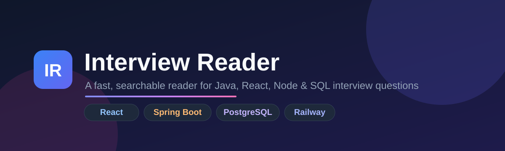
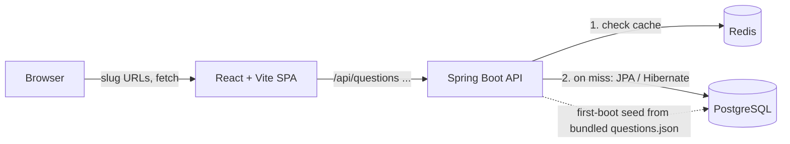

<p align="center">
  
</p>

<h1 align="center">Interview Reader</h1>

<p align="center">
  A fast, searchable reader for <b>Java, React, Node, SQL, HLD, Microservices, Kafka &amp; Design Pattern</b> interview questions —
  with deep-linkable answers, syntax-highlighted code, and progress tracking.
</p>

<p align="center">
  <a href="https://interviewreader.up.railway.app/"><b>🚀 Live demo → interviewreader.up.railway.app</b></a>
</p>

<p align="center">
  
  
  
  
  
  
  
</p>

---

## ✨ Features

- **Instant search & filters** — full-text search plus filters by technology, category, difficulty, and read status.
- **Server-side pagination** with smooth infinite scroll (50 per page).
- **Deep-linkable answers** — every question has its own slug URL, e.g. `/what-is-the-string-pool-in-java`. Shareable and reload-safe.
- **Jump to question** — click the position in the reader footer, type a number, and go straight there.
- **Progress tracking** — visited / marked-as-read state persisted in `localStorage`.
- **Rich answers** — Markdown rendering with tables, blockquotes, images, and lightweight syntax highlighting for Java/JS/TS.
- **Polished UX** — dark mode, resizable sidebar, responsive mobile layout, and an animated hand-drawn 404 state.

## 🖼️ Screenshot

> _Add a screenshot at `docs/screenshot.png` to have it render here._

<p align="center">
  
</p>

Or just open the **[live app](https://interviewreader.up.railway.app/)**.

## 🧱 Tech stack

| Layer      | Stack                                                                 |
|------------|-----------------------------------------------------------------------|
| Frontend   | React 18, Vite 4, Tailwind CSS 3, Framer Motion                       |
| Backend    | Spring Boot 3.2 (Java 21), Spring Web, Spring Data JPA / Hibernate    |
| Database   | PostgreSQL 16                                                          |
| Cache      | Redis (Spring Cache) — read-through caching to cut DB load            |
| Hosting    | Railway (frontend + backend + managed Postgres + Redis)              |

## 🏗️ Architecture



- The SPA calls the backend at `VITE_API_BASE` (defaults to `http://localhost:8082/api`).
- Hibernate owns the schema (`ddl-auto: update`) and the app seeds the `questions` table on first boot from a `questions.json` bundled on the classpath (`QuestionMigrationService`).
- Read endpoints are cached in **Redis** first; Postgres is only queried on a cache miss.

## 📁 Project structure

```
.
├── package.json                 # frontend scripts + deps (root)
├── scripts/
│   └── build-questions.mjs      # (legacy) builds questions.json from markdown
├── frontend/
│   ├── index.html
│   ├── vite.config.js
│   ├── public/questions.json    # seed data (also bundled into the backend jar)
│   └── src/
│       ├── App.jsx              # container: state, routing, data loading
│       ├── main.jsx             # slug router
│       ├── lib/                 # api, storage, slug helpers
│       └── components/          # Sidebar, ReaderPane, Markdown, NotFound, …
└── backend/
    └── src/main/
        ├── java/com/interview/backend/
        │   ├── controller/      # QuestionController, HealthController
        │   ├── entity/ repository/ service/
        │   └── migration/       # QuestionMigrationService (DB seeding)
        └── resources/
            ├── application.yml          # local config
            └── application-prod.yml     # Railway config
```

## 🚀 Getting started (local)

### Prerequisites
- Node.js 18+
- Java 21 + Maven
- PostgreSQL 16 running locally
- Redis running locally

### 1. Database & cache
```bash
# Postgres
docker run --name interview-pg -e POSTGRES_DB=interviewdb \
  -e POSTGRES_USER=postgres -e POSTGRES_PASSWORD=1998 \
  -p 5432:5432 -d postgres:16

# Redis
docker run --name interview-redis -p 6379:6379 -d redis:7
```
> Redis is optional for local dev — if it isn't running, the app logs a warning and
> serves straight from Postgres (caching just no-ops). See [Caching](#-caching-redis).

### 2. Backend
```bash
cd backend
./mvnw spring-boot:run     # serves http://localhost:8082/api
```
Defaults (see `backend/src/main/resources/application.yml`): `interviewdb` / `postgres` / `1998`. Override with env vars — see below.

### 3. Frontend
```bash
npm install
npm run dev                # serves http://127.0.0.1:5173
```

## 🔧 Environment variables

**Backend**

| Variable              | Purpose                          | Local default |
|-----------------------|----------------------------------|---------------|
| `DATABASE_URL`        | JDBC url (`jdbc:postgresql://…`)  | `jdbc:postgresql://localhost:5432/interviewdb` |
| `DATABASE_USER`       | DB user                          | `postgres`    |
| `DATABASE_PASSWORD`   | DB password                      | `1998`        |
| `PORT`                | HTTP port                        | `8082`        |
| `REDIS_URL`           | Redis connection (`redis://[:pass@]host:port`) | `redis://localhost:6379` |
| `CORS_ALLOWED_ORIGINS`| comma-separated allowed origins  | `http://localhost:5173,http://localhost:3000` |

**Frontend**

| Variable         | Purpose                | Default                          |
|------------------|------------------------|----------------------------------|
| `VITE_API_BASE`  | Backend API base URL   | `http://localhost:8082/api`      |

> On Railway, `application-prod.yml` builds the JDBC url from the Postgres plugin's
> `PGHOST/PGPORT/PGDATABASE/PGUSER/PGPASSWORD` variables. Add the **Redis** plugin and
> set `REDIS_URL=${{Redis.REDIS_URL}}`, and set `CORS_ALLOWED_ORIGINS` to your frontend
> origin (`https://interviewreader.up.railway.app`).

## 📡 API

Base path: `/api`

| Method | Endpoint                       | Description                                        |
|--------|--------------------------------|----------------------------------------------------|
| `GET`  | `/questions`                   | Paginated search (`tech, category, difficulty, search, status, page, size`) |
| `GET`  | `/questions/{id}`              | Single question by id                              |
| `GET`  | `/questions/categories?tech=`  | Categories for a technology                        |
| `GET`  | `/questions/stats`             | Totals / counts                                    |
| `GET`  | `/health`                      | Liveness probe (used by Railway healthcheck)       |

## ⚡ Caching (Redis)

The question data is effectively read-only, so read endpoints are cached in Redis to
take load off Postgres. Implemented with Spring's cache abstraction
(`@Cacheable` / `@CacheEvict`) backed by a `RedisCacheManager`.

**Cached reads** (`QuestionService`):

| Cache            | Method                | Key                                                  |
|------------------|-----------------------|------------------------------------------------------|
| `questionSearch` | `searchQuestions(…)`  | `tech|category|difficulty|search|page|size|sort`     |
| `questionById`   | `getById(id)`         | `id`                                                 |
| `categories`     | `getCategoriesByTech` | `tech`                                               |
| `stats`          | `getTotalCount` / `getCountByTech` | `total` / `tech`                        |

Design notes:

- **TTL 10 min, `ir:` key prefix.** Writes (`save` / `saveAll`) evict the caches so
  re-seeds/edits show through.
- **Search caches only anonymous browses** (`condition = "#status == null"`). Status
  filters (Visited / Solved / Unsolved) depend on per-user `visitedIds`/`readIds`, so
  they skip the cache to avoid cross-user leakage.
- **Human-readable JSON values.** Values serialize as JSON via
  `GenericJackson2JsonRedisSerializer`; paginated results use a small `CachedPage`
  wrapper so Spring's `Page` can round-trip through JSON.
- **Fail-open.** A `CacheErrorHandler` logs and falls back to Postgres if Redis is
  unavailable — requests never fail because of the cache.

**Verify it's working locally** — hit the same endpoint twice and watch the backend
log (SQL is logged at `DEBUG`):

```bash
curl -s "http://localhost:8082/api/questions?page=0&size=50" -o /dev/null   # 1st: runs SQL
curl -s "http://localhost:8082/api/questions?page=0&size=50" -o /dev/null   # 2nd: no SQL (cache hit)

docker exec -it interview-redis redis-cli KEYS 'ir:*'        # see cached keys
docker exec -it interview-redis redis-cli GET  'ir:stats::total'
```

## 📝 Content / data

Questions originally came from Markdown files that were compiled into `questions.json`
by `scripts/build-questions.mjs`, then seeded into Postgres on first boot.

> **Note:** the Markdown source files have since been removed from the repo, so the
> **PostgreSQL database is now the source of truth**. Re-running the seed script will
> produce an empty file until the Markdown sources are restored. Manage question
> content directly in the database (or restore the `java/ react/ sql/ …` Markdown and
> re-run the seed) if you need to regenerate `questions.json`.

## 📦 Build

```bash
npm run build     # frontend production build -> frontend/dist
cd backend && ./mvnw clean package   # backend jar
```

---

<p align="center"><sub>Built with React, Spring Boot &amp; PostgreSQL · Deployed on Railway</sub></p>
