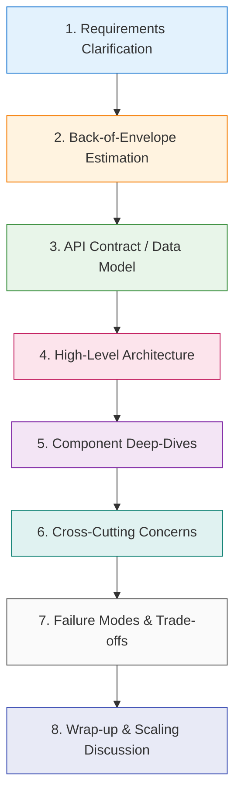

# HLD — Fundamentals & Concepts Interview Questions (Q1–Q50)

---

### Q1. What is High-Level Design (HLD)?
**Difficulty:** `Basic`
**Category:** HLD Fundamentals

#### Answer
HLD is the architecture-level view of a system: it defines the major components (services, databases, caches, queues, load balancers), how they interact, the data flow, and the technology choices — without diving into class/method details. It answers "what are the building blocks and how do they fit together to meet scale, availability, and latency goals?" HLD is driven by non-functional requirements (throughput, availability, consistency) and is what you draw on the whiteboard in a system-design interview.

#### Code Example / Key Takeaways
```text
HLD deliverables:
  - component diagram (services, DB, cache, queue, LB, CDN)
  - data flow + API contracts between components
  - data model & storage choices (SQL/NoSQL/blob)
  - scaling, availability, consistency strategy
Focus: WHAT the blocks are and HOW they interact (not code internals).
```

---

### Q2. What is the difference between HLD and LLD?
**Difficulty:** `Basic`
**Category:** HLD Fundamentals

#### Answer
- **HLD (High-Level Design)**: system architecture — services, databases, caches, queues, communication, scaling, and trade-offs. Audience: architects/teams. Altitude: the whole system.
- **LLD (Low-Level Design)**: the internals of a component — classes, interfaces, methods, data structures, design patterns, and schemas. Audience: developers. Altitude: within a module.

HLD decides *what* components exist; LLD decides *how* each is built.

#### Code Example / Key Takeaways
```text
HLD: services, DB, cache, queue, LB, scaling, consistency  (system altitude)
LLD: classes, interfaces, methods, patterns, schemas       (module altitude)
Interview: HLD = boxes & arrows + trade-offs; LLD = class diagram + API design.
```

---

### Q3. What is scalability?
**Difficulty:** `Basic`
**Category:** HLD Fundamentals

#### Answer
Scalability is a system's ability to handle increased load (users, requests, data) by adding resources, ideally with near-linear cost. It has two forms: **vertical** (bigger machines) and **horizontal** (more machines). A scalable design avoids single bottlenecks (shared DB, single node), uses stateless services behind load balancers, partitions data, and caches hot reads. Good scalability means you can grow capacity without redesigning the system.

#### Code Example / Key Takeaways
```text
Scalable design levers:
  - stateless services + load balancer (scale out easily)
  - partition/shard data (no single DB bottleneck)
  - cache hot reads, async heavy work via queues
  - avoid single points of failure
Goal: add resources -> handle more load, near-linear cost.
```

---

### Q4. What is the difference between vertical and horizontal scaling?
**Difficulty:** `Basic`
**Category:** HLD Fundamentals

#### Answer
- **Vertical (scale up)**: add more power (CPU/RAM/disk) to one machine. Simple, no app changes, but has a hard ceiling, is costly at the high end, and the machine is a single point of failure.
- **Horizontal (scale out)**: add more machines and distribute load. Effectively unlimited, fault-tolerant, but needs stateless services, load balancing, and data partitioning — more architectural complexity.

Most large systems scale horizontally; verticals help for stateful stores up to a point.

#### Code Example / Key Takeaways
```text
Vertical:   1 big box (CPU/RAM++)  -> simple, ceiling, SPOF, costly
Horizontal: many boxes + LB        -> near-limitless, fault-tolerant, complex
Prefer horizontal for stateless tiers; vertical + replication for stateful DBs.
```

---

### Q5. What is availability?
**Difficulty:** `Basic`
**Category:** HLD Fundamentals

#### Answer
Availability is the percentage of time a system is operational and serving requests, usually expressed in "nines" (99.9% = ~8.7h downtime/year; 99.99% = ~52min; 99.999% = ~5min). It's achieved through redundancy (no single point of failure), replication, failover, health checks, and graceful degradation. Availability often trades against consistency (CAP) — highly available systems may serve slightly stale data during partitions.

#### Code Example / Key Takeaways
```text
Availability "nines":
  99%     -> ~3.65 days/year downtime
  99.9%   -> ~8.76 hours/year
  99.99%  -> ~52.6 min/year
  99.999% -> ~5.26 min/year
Achieve via: redundancy, replication, failover, health checks, no SPOF.
```

---

### Q6. What is reliability?
**Difficulty:** `Basic`
**Category:** HLD Fundamentals

#### Answer
Reliability is the probability that a system performs correctly (produces correct results without failing or losing data) over a period of time. It's broader than availability: a system can be available (responding) but unreliable (returning wrong data or losing writes). Reliability comes from durable storage, replication, idempotency, data validation, thorough testing, and handling partial failures gracefully. Metrics: MTBF (mean time between failures), error rate.

#### Code Example / Key Takeaways
```text
Availability = "is it up?"   Reliability = "does it work correctly, without loss?"
Reliability via: durable/replicated storage, idempotency, validation,
                 graceful partial-failure handling, testing.
Metrics: MTBF, error rate, data-loss incidents.
```

---

### Q7. What is fault tolerance?
**Difficulty:** `Basic`
**Category:** HLD Fundamentals

#### Answer
Fault tolerance is a system's ability to keep operating (possibly degraded) when components fail — the defining trait of distributed systems, where partial failure is normal. Techniques: redundancy/replication (survive node loss), failover (promote a standby), retries with backoff, circuit breakers and bulkheads (contain failures), and graceful degradation (drop non-critical features). The goal is that any single failure has a contained, recoverable impact — no total outage.

#### Code Example / Key Takeaways
```text
Fault tolerance techniques:
  redundancy/replication -> survive node loss
  failover -> promote standby
  retry+backoff, circuit breaker, bulkhead -> contain failures
  graceful degradation -> drop non-critical features
Assume any component can fail; keep blast radius small.
```

---

### Q8. What is elasticity?
**Difficulty:** `Basic`
**Category:** HLD Fundamentals

#### Answer
Elasticity is the ability to **automatically** add or remove resources in response to real-time demand — scaling out during spikes and back in when idle to save cost. It builds on horizontal scalability plus autoscaling (metrics-driven: CPU, queue depth, RPS) and stateless services. Elasticity differs from scalability: scalability is *can* it grow; elasticity is *automatically* matching capacity to load, both up and down.

#### Code Example / Key Takeaways
```text
Scalability = can grow.   Elasticity = auto-matches capacity to demand (up AND down).
Requires: stateless services + autoscaler (CPU/RPS/queue-depth triggers).
Benefit: handle spikes without over-provisioning; cut cost when idle.
```

---

### Q9. What is a stateless service?
**Difficulty:** `Basic`
**Category:** HLD Fundamentals

#### Answer
A stateless service keeps no client/session state between requests — each request carries everything needed (or fetches it from a shared store like Redis/DB). Any instance can handle any request, so you can freely add/remove instances behind a load balancer, restart them without data loss, and scale horizontally. Session data is externalized. Statelessness is the foundation of horizontal scalability and elasticity.

#### Code Example / Key Takeaways
```text
Stateless: request has all it needs (or reads shared store) -> any instance serves it
  -> free horizontal scaling, easy restarts, simple load balancing.
Externalize state: session/cache in Redis, data in DB (not in-process memory).
```

---

### Q10. What is a stateful service?
**Difficulty:** `Basic`
**Category:** HLD Fundamentals

#### Answer
A stateful service maintains state across requests locally (in-memory sessions, connections, or local data) — e.g. databases, caches, WebSocket servers, or Kafka brokers. It's harder to scale: requests may need to reach the specific instance holding their state (sticky sessions), scaling/restarting risks state loss (needs replication), and rebalancing is complex. Use stateful services where state locality is essential (datastores, real-time connections), and manage them with replication and careful partitioning.

#### Code Example / Key Takeaways
```text
Stateful: instance holds state locally (sessions, connections, data).
Challenges: sticky routing, replication for durability, complex scaling/rebalancing.
Examples: databases, caches, WebSocket servers, Kafka brokers.
Keep the stateless tier large; contain state in well-managed stateful stores.
```

---

### Q11. What is a load balancer?
**Difficulty:** `Basic`
**Category:** HLD Fundamentals

#### Answer
A load balancer distributes incoming traffic across multiple backend instances to improve throughput, availability, and to avoid overloading any one node. It does health checks (routing only to healthy instances), supports strategies (round robin, least connections, weighted, hash), and can terminate TLS. It's essential to horizontal scaling and enables zero-downtime deploys (drain/rotate instances). Can operate at L4 (TCP) or L7 (HTTP-aware).

#### Code Example / Key Takeaways
```text
Clients -> LB -> [instance A, B, C]  (health-checked, load-distributed)
Strategies: round robin, least connections, weighted, IP/consistent hash.
Enables: horizontal scale, HA, zero-downtime deploys, TLS termination.
```

---

### Q12. What is the difference between Layer 4 and Layer 7 load balancing?
**Difficulty:** `Intermediate`
**Category:** HLD Fundamentals

#### Answer
- **Layer 4 (transport)**: routes by IP/port/TCP without inspecting content. Very fast, protocol-agnostic, but can't make content-based decisions.
- **Layer 7 (application)**: understands HTTP — can route by URL path, headers, cookies, method; do TLS termination, caching, compression, and rewrites. More features and smarter routing, at slightly higher cost.

Use L4 for raw throughput/non-HTTP; L7 for HTTP-aware routing (path-based microservice routing, sticky sessions, A/B).

#### Code Example / Key Takeaways
```text
L4: routes by IP:port/TCP (fast, content-blind)      -> raw throughput, any protocol
L7: routes by HTTP path/header/cookie (smart)         -> path routing, TLS, caching, A/B
Example L7: /api/orders -> order-svc ; /api/users -> user-svc
```

---

### Q13. What is DNS?
**Difficulty:** `Basic`
**Category:** HLD Fundamentals

#### Answer
DNS (Domain Name System) is the internet's distributed directory that translates human-readable domain names (`example.com`) into IP addresses. It's hierarchical (root → TLD → authoritative servers) and heavily cached (TTLs). In system design it also enables load distribution (round-robin DNS, GeoDNS routing users to the nearest region) and is the first hop in service discovery for many architectures.

#### Code Example / Key Takeaways
```text
example.com -> DNS -> 93.184.216.34
Hierarchy: root -> TLD (.com) -> authoritative NS -> record (A/AAAA/CNAME)
Uses in HLD: GeoDNS (nearest region), round-robin DNS (crude LB), TTL caching.
```

---

### Q14. How does DNS resolution work?
**Difficulty:** `Intermediate`
**Category:** HLD Fundamentals

#### Answer
When you request `example.com`: the resolver checks caches (browser → OS → recursive resolver). On a miss, the recursive resolver queries the **root** server (returns the `.com` TLD server), then the **TLD** server (returns the domain's authoritative nameserver), then the **authoritative** server (returns the A/AAAA record). The IP is cached per TTL at each level, so subsequent lookups are fast. The client then connects to the returned IP.

#### Code Example / Key Takeaways
```text
browser cache -> OS cache -> recursive resolver
  miss -> ROOT server -> ".com" TLD server -> AUTHORITATIVE NS -> A record (IP)
Result cached at each hop per TTL. Then client connects to the IP.
```

---

### Q15. What is a CDN?
**Difficulty:** `Basic`
**Category:** HLD Fundamentals

#### Answer
A CDN (Content Delivery Network) is a globally distributed network of edge servers that cache content close to users, reducing latency and offloading origin servers. It's used for static assets (images, JS/CSS, video) and increasingly dynamic content via edge compute. Users are routed (GeoDNS/anycast) to the nearest edge; on a cache miss the edge fetches from origin and caches it per TTL. Benefits: lower latency, less origin load, DDoS absorption, and bandwidth savings.

#### Code Example / Key Takeaways
```text
User -> nearest CDN edge (cached asset) -> served fast
  cache miss -> edge fetches from ORIGIN -> caches per TTL -> serves
Benefits: low latency (geo-close), origin offload, DDoS absorption, cheaper bandwidth.
Best for: static assets, video; edge compute for some dynamic content.
```

---

### Q16. What is a reverse proxy?
**Difficulty:** `Basic`
**Category:** HLD Fundamentals

#### Answer
A reverse proxy sits in front of backend servers and handles client requests on their behalf — doing load balancing, TLS termination, caching, compression, routing, and security filtering. Clients think they talk to one server; the proxy hides the backend topology. Contrast with a forward proxy (fronts clients for outbound traffic). Examples: Nginx, Envoy, HAProxy, API gateways. It's a common single entry point that improves security, performance, and flexibility.

#### Code Example / Key Takeaways
```text
Clients -> Reverse Proxy (Nginx/Envoy) -> [backend servers]
Does: load balance, TLS terminate, cache, compress, route, filter, hide topology.
Reverse proxy = protects/serves the SERVERS (vs forward proxy = fronts CLIENTS).
```

---

### Q17. What is an API Gateway?
**Difficulty:** `Basic`
**Category:** HLD Fundamentals

#### Answer
An API Gateway is the single entry point for clients into a microservices backend. It handles cross-cutting concerns so services don't each reimplement them: routing/composition, authentication/authorization, rate limiting, TLS, request/response transformation, caching, and observability. It decouples clients from internal topology. Risk: it can become a bottleneck or "god" component — keep business logic out of it. Examples: Kong, AWS API Gateway, Spring Cloud Gateway.

#### Code Example / Key Takeaways
```text
Clients -> API Gateway -> [order-svc, user-svc, payment-svc]
Handles: routing, authN/authZ, rate limiting, TLS, transformation, caching, metrics.
Keep it thin (no business logic). Beware it becoming a bottleneck/SPOF (scale it).
```

---

### Q18. What is service discovery?
**Difficulty:** `Intermediate`
**Category:** HLD Fundamentals

#### Answer
Service discovery lets services find each other by logical name instead of hardcoded IPs, essential in dynamic environments where instances come and go with ephemeral addresses. A **registry** (Eureka, Consul, etcd, or Kubernetes DNS) tracks healthy instances via registration + heartbeats; clients or a router resolve the name to a current healthy instance. It underpins load balancing and elasticity by keeping routing up to date as instances scale.

#### Code Example / Key Takeaways
```text
Instance startup -> REGISTER {name, host:port, health} + heartbeat
Caller -> "give me healthy 'orders' instances" -> [ip1, ip2] -> load balance
Registry evicts dead instances. Tools: Eureka, Consul, etcd, k8s DNS.
```

---

### Q19. What is the difference between client-side and server-side service discovery?
**Difficulty:** `Intermediate`
**Category:** HLD Fundamentals

#### Answer
- **Client-side**: the client queries the registry for healthy instances and picks one itself (client-side load balancing). Fewer hops, but every client needs discovery logic (e.g. Netflix Eureka + Ribbon).
- **Server-side**: the client calls a stable endpoint (load balancer / k8s Service / DNS) that queries the registry and routes for it. Clients stay simple; the router is a managed component (e.g. Kubernetes Services, AWS ELB).

#### Code Example / Key Takeaways
```text
Client-side:  client -> registry -> pick instance -> call it   (client does LB)
Server-side:  client -> stable LB/DNS -> registry -> route     (LB does it)
Client-side = fewer hops, smart clients; Server-side = simple clients, managed router.
```

---

### Q20. What is a microservice?
**Difficulty:** `Basic`
**Category:** HLD Fundamentals

#### Answer
A microservice is a small, independently deployable service that owns one business capability and its data, communicating with others over the network (REST/gRPC/events). Benefits: independent deployment/scaling, team autonomy, technology freedom, and fault isolation. Costs: distributed-system complexity (network calls, eventual consistency, observability, ops overhead). Services are organized around bounded contexts (DDD), and each owns its database (no shared schema).

#### Code Example / Key Takeaways
```text
Microservice = one business capability + its own data + independent deploy.
Pros: independent scale/deploy, team autonomy, tech freedom, fault isolation.
Cons: network complexity, eventual consistency, observability & ops overhead.
Organize by bounded context; database-per-service.
```

---

### Q21. What is the difference between a monolith and microservices?
**Difficulty:** `Basic`
**Category:** HLD Fundamentals

#### Answer
- **Monolith**: one deployable unit; all modules share a codebase, process, and often one database. Simple to build/deploy/test early, low latency (in-process calls), but scaling is all-or-nothing, deploys are risky, and it can become tangled at scale.
- **Microservices**: many independently deployable services. Independent scaling/deploys and team autonomy, at the cost of network complexity and eventual consistency.

Start monolith-first; extract services when scaling/team-friction pain is real.

#### Code Example / Key Takeaways
```text
Monolith:      1 deploy, 1 DB, in-process calls  -> simple early, scales as a whole
Microservices: N deploys, DB-per-service, network -> independent scale, more complexity
Rule: modular monolith first; split along proven seams when pain justifies it.
```

---

### Q22. What is horizontal partitioning?
**Difficulty:** `Intermediate`
**Category:** HLD Fundamentals

#### Answer
Horizontal partitioning splits a table's **rows** across multiple partitions/databases, each holding a subset (e.g. users A–M in one, N–Z in another), based on a partition key. It spreads data and load so no single store holds everything — enabling scale beyond one machine. This is the basis of **sharding**. Contrast with vertical partitioning (splitting **columns**/features into separate tables/services).

#### Code Example / Key Takeaways
```text
Horizontal (rows): users 1..1M -> shard0; 1M..2M -> shard1  (same schema, split rows)
Vertical (columns): profile table vs activity table (split by column/feature)
Horizontal partitioning = foundation of sharding -> scale writes & storage.
```

---

### Q23. What is database sharding?
**Difficulty:** `Intermediate`
**Category:** HLD Fundamentals

#### Answer
Sharding is horizontal partitioning of data across multiple independent databases (shards), each owning a subset determined by a **shard key**. It scales writes and storage beyond a single machine. Strategies: **range** (by value ranges), **hash** (even distribution), **directory** (lookup table), or **consistent hashing** (minimal reshuffling on change). Costs: cross-shard queries/joins/transactions are hard, rebalancing is complex, and a poor shard key causes **hot shards**. Pick a high-cardinality, evenly-accessed key.

#### Code Example / Key Takeaways
```text
shard = hash(shard_key) % N  ->  data spread across N databases
Strategies: range | hash | directory | consistent hashing
Costs: no cross-shard JOIN/txn, complex rebalance, hot shards on bad key.
Pick high-cardinality, evenly-accessed shard key.
```

---

### Q24. What is replication?
**Difficulty:** `Basic`
**Category:** HLD Fundamentals

#### Answer
Replication keeps copies of data on multiple nodes for availability, durability, and read scaling. If one node fails, another serves the data (failover). Models: **synchronous** (write waits for replicas — strong consistency, higher latency) vs **asynchronous** (write returns immediately, replicas catch up — lower latency, possible staleness/loss). Topologies: primary-replica (single writer) and multi-primary (multiple writers, needs conflict resolution). Replication complements sharding (each shard is also replicated).

#### Code Example / Key Takeaways
```text
Primary --replicate--> Replica1, Replica2   (copies for HA + read scaling)
Sync:  wait for replicas (strong, slower).  Async: return now (fast, may lag/lose).
Failover: promote a replica if primary dies. Combine with sharding for scale + HA.
```

---

### Q25. What is primary-replica (master-slave) database architecture?
**Difficulty:** `Intermediate`
**Category:** HLD Fundamentals

#### Answer
One **primary** node handles all writes; one or more **replicas** copy the primary's data and serve reads. Benefits: read scaling (fan reads across replicas), high availability (promote a replica on primary failure), and offloading backups/analytics to replicas. Trade-offs: **replication lag** means replica reads can be slightly stale (eventual consistency for reads), and writes remain single-primary (a write bottleneck). Route writes to primary, reads to replicas, and handle read-your-writes carefully.

#### Code Example / Key Takeaways
```text
Writes -> PRIMARY -> replicate -> REPLICAS -> serve reads
Pros: read scaling, HA (promote replica), offload backups/analytics.
Cons: replication lag (stale reads), single-primary write bottleneck.
Read-your-writes: pin the user to primary briefly after a write.
```

---

### Q26. What is database indexing?
**Difficulty:** `Basic`
**Category:** HLD Fundamentals

#### Answer
An index is an auxiliary data structure (usually a B-tree, or hash/inverted index) that lets the database find rows by a column's value without scanning the whole table — turning O(n) lookups into O(log n). It dramatically speeds reads/filters/sorts on indexed columns. Cost: extra storage and slower writes (indexes must be updated on insert/update/delete). Index the columns you filter/join/sort on; avoid over-indexing.

#### Code Example / Key Takeaways
```text
No index:  SELECT ... WHERE email=? -> full table scan (O(n))
With index on email: B-tree lookup (O(log n))
Trade-off: faster reads, slower writes + extra storage.
Index columns used in WHERE/JOIN/ORDER BY; don't over-index.
```

---

### Q27. What is the difference between SQL and NoSQL?
**Difficulty:** `Basic`
**Category:** HLD Fundamentals

#### Answer
- **SQL (relational)**: structured schema, ACID transactions, strong consistency, powerful joins/queries. Scales mainly vertically + read replicas; sharding is harder. Best for structured, relational, transactional data (payments, orders).
- **NoSQL**: flexible schema, horizontal scaling, high throughput, often eventual consistency. Types: document (MongoDB), key-value (Redis/DynamoDB), wide-column (Cassandra), graph (Neo4j). Best for large scale, flexible/semi-structured data, high write volume.

Choose by data model, consistency needs, and scale.

#### Code Example / Key Takeaways
```text
SQL:   fixed schema, ACID, joins, strong consistency   -> transactional/relational data
NoSQL: flexible schema, horizontal scale, high throughput, often eventual consistency
       (document | key-value | wide-column | graph)
Pick by: data model, consistency requirement, scale/write volume.
```

---

### Q28. When would you choose MongoDB?
**Difficulty:** `Intermediate`
**Category:** HLD Fundamentals

#### Answer
Choose MongoDB (document store) when your data is semi-structured/hierarchical and the schema evolves (product catalogs, user profiles, content/CMS), you want to store an aggregate as one document (fewer joins), and you need horizontal scaling via sharding with flexible querying. It offers rich queries, secondary indexes, and tunable consistency. Avoid it when you need complex multi-entity ACID transactions across many relations — a relational DB fits better.

#### Code Example / Key Takeaways
```text
Choose MongoDB when:
  - semi-structured / evolving schema (catalogs, profiles, CMS)
  - aggregate stored as one document (fewer joins)
  - horizontal scale via sharding + flexible queries + secondary indexes
Avoid when: heavy multi-entity ACID transactions across relations (use SQL).
```

---

### Q29. When would you choose PostgreSQL?
**Difficulty:** `Intermediate`
**Category:** HLD Fundamentals

#### Answer
Choose PostgreSQL when you need strong **ACID transactions**, relational integrity (foreign keys, constraints), complex queries/joins, and correctness — e.g. financial/orders/inventory systems. It's also very versatile: JSONB for semi-structured data, full-text search, geospatial (PostGIS), and extensions. It scales via read replicas and (with more effort) partitioning/sharding. Prefer it as a safe default for transactional workloads; reach for NoSQL when scale/flexibility outweighs relational needs.

#### Code Example / Key Takeaways
```text
Choose PostgreSQL when:
  - ACID transactions + relational integrity (FKs, constraints)
  - complex joins/queries, correctness-critical (payments, orders, inventory)
  - versatile: JSONB, full-text, PostGIS, extensions
Scale: read replicas, partitioning. Great transactional default.
```

---

### Q30. What is Redis?
**Difficulty:** `Basic`
**Category:** HLD Fundamentals

#### Answer
Redis is an in-memory data store (key-value + rich data structures: strings, hashes, lists, sets, sorted sets, streams) used primarily as a **cache**, but also for rate limiting, sessions, leaderboards, pub/sub, distributed locks, and queues. It's extremely fast (sub-millisecond, RAM-based), supports TTLs/eviction, optional persistence (RDB/AOF), and clustering/replication for scale and HA. Its versatility makes it a Swiss-army knife in system design.

#### Code Example / Key Takeaways
```text
Redis = in-memory store (sub-ms). Uses:
  cache, session store, rate limiter, leaderboard (sorted sets),
  pub/sub, distributed lock, queue/stream.
TTL + eviction; persistence (RDB/AOF); replication + cluster for scale/HA.
```

---

### Q31. When should Redis be used?
**Difficulty:** `Basic`
**Category:** HLD Fundamentals

#### Answer
Use Redis when you need very low-latency access to hot, ephemeral, or computed data: caching frequent DB reads (cache-aside), sessions/tokens, rate-limiting counters, leaderboards/rankings (sorted sets), real-time presence, distributed locks, or lightweight pub/sub. It's not your durable source of truth (data lives in RAM; persistence is best-effort). Use it to offload the database and speed reads — with a TTL/invalidation strategy to manage staleness.

#### Code Example / Key Takeaways
```text
Use Redis for: cache-aside, sessions, rate-limit counters, leaderboards,
               presence, distributed locks, pub/sub.
Not for: system of record (RAM-based; persistence best-effort).
Always pair with TTL/invalidation to control staleness.
```

---

### Q32. What is the cache-aside pattern?
**Difficulty:** `Intermediate`
**Category:** HLD Fundamentals

#### Answer
In cache-aside (lazy loading) the application manages the cache: on read, check the cache; on a **miss**, load from the DB, populate the cache (with TTL), and return. On write, update the DB and **invalidate** the cache entry. Only requested data is cached (efficient), and a cache outage just means more DB hits. Concerns: stale data (use TTLs) and thundering-herd on popular misses (use locks/singleflight).

#### Code Example / Key Takeaways
```text
READ:  cache hit? return; else DB -> populate cache (TTL) -> return
WRITE: update DB -> invalidate cache key
Pros: cache only what's used; cache outage = more DB load, not failure.
Watch: staleness (TTL), thundering herd on hot miss (lock/singleflight).
```

---

### Q33. What is a write-through cache?
**Difficulty:** `Intermediate`
**Category:** HLD Fundamentals

#### Answer
In write-through, every write goes to the cache **and** the database **synchronously** (as one operation), so the cache is always consistent with the DB and reads are fast/fresh. Trade-off: writes are slower (two writes) and you may cache data that's never read (wasted memory). Good when reads dominate and you want cache freshness without invalidation logic. Often paired with cache-aside reads.

#### Code Example / Key Takeaways
```text
WRITE: app -> write cache AND DB synchronously -> both consistent
Pros: cache always fresh, fast fresh reads, no separate invalidation.
Cons: slower writes (double write); may cache never-read data.
Best when reads >> writes and freshness matters.
```

---

### Q34. What is a write-back (write-behind) cache?
**Difficulty:** `Hard`
**Category:** HLD Fundamentals

#### Answer
In write-back, writes go to the cache and are acknowledged immediately; the cache **asynchronously** flushes to the database later (batched). This gives very fast writes and absorbs bursts, but risks **data loss** if the cache fails before flushing, and adds complexity (ordering, consistency). Use it for high-write, loss-tolerant workloads (metrics, counters, view counts) where throughput matters more than durability of each write.

#### Code Example / Key Takeaways
```text
WRITE: app -> cache (ack immediately) -> async batch flush -> DB (later)
Pros: very fast writes, absorbs bursts, fewer DB writes (batched).
Cons: DATA LOSS risk if cache dies pre-flush; more complexity.
Use for: high-write, loss-tolerant (counters, metrics, view counts).
```

---

### Q35. What is cache invalidation?
**Difficulty:** `Intermediate`
**Category:** HLD Fundamentals

#### Answer
Cache invalidation is removing or updating stale cache entries when the underlying data changes — famously "one of the two hard things in CS." Strategies: **TTL** (expire after N seconds — simple, bounded staleness), **explicit invalidation** (delete/update the key on write), and **event-based** (invalidate via a change stream/Kafka). Trade-offs: too aggressive → low hit rate; too lax → stale data. Choose per data's tolerance for staleness.

#### Code Example / Key Takeaways
```text
Strategies:
  TTL         -> expire after N sec (simple, bounded staleness)
  explicit    -> delete/update key on write (fresh, needs write hooks)
  event-based -> invalidate on CDC/Kafka change event (scales, decoupled)
Balance: aggressive = low hit rate; lax = stale data. Match data's staleness tolerance.
```

---

### Q36. What is a message queue?
**Difficulty:** `Basic`
**Category:** HLD Fundamentals

#### Answer
A message queue is a broker that buffers messages between producers and consumers, decoupling them in time. Producers enqueue and move on; consumers process at their own pace. It enables async processing, load leveling (absorb spikes), reliable delivery (acks, retries, DLQ), and horizontal scaling via competing consumers. Classic queues (RabbitMQ, SQS) deliver each message to one consumer and delete on ack. Improves resilience and responsiveness.

#### Code Example / Key Takeaways
```text
Producer -> [ Queue ] -> Consumer(s)   (decouple in time)
Benefits: async processing, load leveling, retries/DLQ, competing-consumer scaling.
Classic queue: one consumer per message, delete on ack (RabbitMQ, SQS).
```

---

### Q37. What is the difference between a queue and a topic?
**Difficulty:** `Intermediate`
**Category:** HLD Fundamentals

#### Answer
- **Queue (point-to-point)**: each message is delivered to exactly **one** consumer among competing consumers — used for distributing tasks (do this once).
- **Topic (publish-subscribe)**: each message is delivered to **all** subscribers — used for broadcasting events to many independent consumers.

Kafka blends these: a topic with one consumer group behaves queue-like (work split across the group), while multiple groups get pub/sub fan-out.

#### Code Example / Key Takeaways
```text
Queue (P2P):    msg -> ONE consumer (competing consumers) -> task distribution
Topic (Pub/Sub): msg -> ALL subscribers -> event broadcast/fan-out
Kafka: one consumer group = queue-like; multiple groups = pub/sub.
```

---

### Q38. What is the difference between Kafka and RabbitMQ?
**Difficulty:** `Intermediate`
**Category:** HLD Fundamentals

#### Answer
- **Kafka**: a distributed, partitioned **log** — high throughput, retained/replayable, per-partition ordering, many consumer groups. Best for event streaming, pipelines, and multiple consumers of the same data.
- **RabbitMQ**: a **message broker** with rich routing (exchanges) — pushes to consumers, deletes on ack, flexible routing, lower-latency task delivery. Best for complex routing, RPC, and traditional task queues.

Kafka = durable replayable streams; RabbitMQ = flexible routing/task queue.

#### Code Example / Key Takeaways
```text
Kafka:    log, pull, retained+replayable, per-partition order, high throughput
          -> streams, pipelines, many consumers, event sourcing
RabbitMQ: broker, push, delete-on-ack, rich exchange routing, low-latency tasks
          -> complex routing, RPC, task queues
```

---

### Q39. What is asynchronous processing?
**Difficulty:** `Basic`
**Category:** HLD Fundamentals

#### Answer
Async processing hands off work to be done later (via a queue/log/background worker) instead of doing it inline within the request. The caller returns immediately (e.g. "order accepted, processing"), and the heavy/slow work (emails, image processing, payments settlement) happens in the background. Benefits: fast responses, load leveling, resilience (retries), and decoupling. Cost: eventual consistency and more moving parts (queues, workers, status tracking).

#### Code Example / Key Takeaways
```text
Sync inline: request -> do everything -> respond (slow, coupled)
Async: request -> enqueue job -> respond NOW; worker processes later
Benefits: fast responses, load leveling, retries, decoupling.
Cost: eventual consistency, extra infra (queue, workers, status).
```

---

### Q40. What is the difference between synchronous and asynchronous communication?
**Difficulty:** `Basic`
**Category:** HLD Fundamentals

#### Answer
- **Synchronous**: caller waits for a response (REST/gRPC request-response). Simple, immediate, but couples caller availability/latency to the callee; chains multiply latency and cascading-failure risk.
- **Asynchronous**: caller emits a message/event and doesn't wait (queue/Kafka). Decoupled, resilient, absorbs spikes, but eventual consistency and harder debugging.

Use sync for queries needing an immediate answer; async for commands/events processable in the background.

#### Code Example / Key Takeaways
```text
Sync:  request -> wait -> response (coupled latency/availability) -> queries
Async: emit event -> continue; consumer processes later -> commands/events
Choose sync when you need the answer now; async to decouple & absorb load.
```

---

### Q41. What is the difference between REST and gRPC?
**Difficulty:** `Intermediate`
**Category:** HLD Fundamentals

#### Answer
- **REST**: HTTP/JSON, ubiquitous, human-readable, cacheable, language-agnostic, browser-friendly. Verbose, slower serialization, no built-in contract (needs OpenAPI).
- **gRPC**: HTTP/2 + Protobuf (binary), strongly-typed contract via `.proto`, fast, compact, supports streaming (client/server/bidi). Best for internal, high-throughput, low-latency service-to-service calls; limited browser support without gRPC-Web.

Use REST at the public edge; gRPC for internal microservice communication.

#### Code Example / Key Takeaways
```text
REST:  HTTP/JSON, human-readable, cacheable, browser-friendly, no strict contract
gRPC:  HTTP/2 + Protobuf, typed contract, compact/fast, streaming
Use: REST at public edge; gRPC for internal high-throughput service-to-service.
```

---

### Q42. What is a WebSocket?
**Difficulty:** `Intermediate`
**Category:** HLD Fundamentals

#### Answer
WebSocket is a protocol providing a **full-duplex, persistent** TCP connection between client and server. After an HTTP `Upgrade` handshake, either side can push messages any time with low overhead (small frames). It's ideal for real-time bidirectional apps: chat, multiplayer games, collaborative editing, live trading, notifications. Costs: stateful connections complicate load balancing/scaling (need sticky sessions + a pub/sub backplane) and require heartbeats + reconnection logic.

#### Code Example / Key Takeaways
```text
HTTP Upgrade -> persistent full-duplex TCP -> both sides push anytime (low overhead)
Use: chat, games, collab editing, live feeds, notifications.
Scale: sticky sessions + pub/sub backplane (Redis/Kafka); heartbeats + reconnect.
```

---

### Q43. What is the difference between HTTP polling and long polling?
**Difficulty:** `Intermediate`
**Category:** HLD Fundamentals

#### Answer
- **Short polling**: client requests on a fixed interval (every N sec); the server responds immediately (often empty). Simple, but wasteful and laggy (latency up to the interval).
- **Long polling**: client sends a request and the server **holds it open** until data is available (or timeout), then responds; the client immediately re-requests. Near-real-time over plain HTTP, fewer empty responses — but holds connections and has reconnection overhead.

For true push, prefer SSE/WebSocket.

#### Code Example / Key Takeaways
```text
Short polling: request every N sec -> often empty -> wasteful, lag up to N
Long polling:  request held open until data/timeout -> near real-time, connection churn
Better for push: SSE (server->client) or WebSocket (bidirectional).
```

---

### Q44. What is idempotency?
**Difficulty:** `Intermediate`
**Category:** HLD Fundamentals

#### Answer
An idempotent operation produces the same result whether applied once or many times — critical when clients/networks retry (at-least-once delivery, timeouts). GET/PUT/DELETE are naturally idempotent; POST usually isn't. Make operations idempotent with an **idempotency key** (unique request id) + a dedup store/unique constraint, so a retried "charge $10" doesn't double-charge. It's foundational for safe retries in distributed and payment systems.

#### Code Example / Key Takeaways
```text
Idempotent: apply once or N times -> same result (safe to retry).
Implement: client sends Idempotency-Key -> server stores it (unique constraint)
           -> duplicate key -> return stored result, don't re-execute.
Essential for retries, at-least-once delivery, payments.
```

---

### Q45. What is rate limiting?
**Difficulty:** `Intermediate`
**Category:** HLD Fundamentals

#### Answer
Rate limiting caps how many requests a client can make in a time window to protect services from overload, abuse, and to enforce fair use/quotas. Algorithms: **token bucket** (refill at a rate, allow bursts), **leaky bucket** (smooth constant rate), **fixed/sliding window** counters. In distributed systems, back the counter with Redis so limits hold across instances. Exceeding returns HTTP 429 with `Retry-After`.

#### Code Example / Key Takeaways
```text
Algorithms: token bucket (bursts), leaky bucket (smooth), fixed/sliding window
Distributed: Redis-backed counter keyed by client (API key/user/IP)
Exceed -> HTTP 429 + Retry-After. Protects from overload/abuse, enforces quotas.
```

---

### Q46. What is a circuit breaker?
**Difficulty:** `Intermediate`
**Category:** HLD Fundamentals

#### Answer
A circuit breaker stops calling a failing dependency to let it recover and to fail fast (avoiding wasted work and cascading failures). States: **Closed** (calls flow, failures counted), **Open** (once a threshold is crossed, calls short-circuit to a fallback for a cooldown), **Half-Open** (a few trial calls test recovery; success closes, failure re-opens). It converts a slow/failing dependency into a fast, contained failure.

#### Code Example / Key Takeaways
```text
Closed (calls flow, count failures) --threshold--> Open (fail fast to fallback)
Open --cooldown--> Half-Open (trial calls) --success--> Closed / --fail--> Open
Prevents cascading failures; gives the downstream time to recover.
```

---

### Q47. What is retry with exponential backoff?
**Difficulty:** `Intermediate`
**Category:** HLD Fundamentals

#### Answer
Retrying re-attempts a transient failure; **exponential backoff** increases the delay between attempts (1s, 2s, 4s…) so you don't hammer a struggling service, and **jitter** randomizes delays so many clients don't retry in lockstep (thundering herd). Only retry **idempotent** operations, cap total attempts/time, and pair with a circuit breaker so retries don't prolong an outage.

#### Code Example / Key Takeaways
```text
attempt delays: 1s, 2s, 4s, 8s ... (exponential) + random jitter (avoid herd)
Rules: only idempotent ops, bound attempts/time, combine with circuit breaker.
Prevents overwhelming a recovering service and synchronized retry storms.
```

---

### Q48. What is a timeout?
**Difficulty:** `Basic`
**Category:** HLD Fundamentals

#### Answer
A timeout caps how long you wait for an operation (connect, request, query) before giving up, so a slow dependency fails fast instead of pinning threads/connections indefinitely — the #1 defense against cascading failures. Set connect and request timeouts on every network call, tune them to realistic latencies (not too tight → false failures, not too loose → hung threads), and combine with retries and circuit breakers.

#### Code Example / Key Takeaways
```text
No timeout: slow dependency hangs your threads forever -> cascading failure.
Set connect + request timeouts on EVERY network call.
Tune: too tight = false failures; too loose = hung threads.
Combine with retry + circuit breaker.
```

---

### Q49. What is a distributed system?
**Difficulty:** `Basic`
**Category:** HLD Fundamentals

#### Answer
A distributed system is a collection of independent computers (nodes) that appear to users as one coherent system, coordinating over a network to share work and data. It provides scalability, availability, and fault tolerance beyond a single machine — but introduces hard problems: partial failure, network unreliability/latency, no global clock, consistency vs availability (CAP), and coordination/consensus. Almost all large-scale systems are distributed.

#### Code Example / Key Takeaways
```text
Many nodes over a network -> appear as one system (scale, HA, fault tolerance).
Hard problems: partial failure, unreliable network, no global clock,
               CAP (consistency vs availability), consensus/coordination.
Design assuming any node/link can fail at any time.
```

---

### Q50. What are the major components you consider when designing a scalable system?
**Difficulty:** `Intermediate`
**Category:** HLD Fundamentals

#### Answer
A standard toolkit: **DNS/CDN** (route + cache at edge), **load balancers** (distribute traffic), **stateless app services** (scale out), **caching** (Redis for hot reads), **databases** (SQL/NoSQL, replicated + sharded), **message queues/streams** (async, decoupling — Kafka/RabbitMQ), **object/blob storage** (files/media), **search** (Elasticsearch), plus cross-cutting: **API gateway**, **service discovery**, **observability** (logs/metrics/traces), **rate limiting/circuit breakers**, and **multi-region/DR**. Drive choices from requirements (RPS, data size, latency, consistency, availability).

#### Code Example / Key Takeaways
```text
Client -> DNS/CDN -> LB -> API Gateway -> stateless services
   services -> Cache (Redis) -> DB (replicated + sharded)
   services -> Queue/Kafka (async) -> workers
   services -> Object storage (files), Search (Elasticsearch)
Cross-cutting: discovery, observability, rate limit, circuit breaker, multi-region/DR.
Drive every choice from requirements (RPS, data, latency, consistency, availability).
```

---

### Q51. How do you do back-of-envelope estimation (capacity planning) in a system design interview?

**Difficulty:** `Intermediate`
**Category:** HLD Fundamentals

#### Answer

Back-of-envelope estimation is a quick quantitative sanity check to size components **before** you draw boxes. The goal is to convert product requirements into concrete numbers (RPS, storage, bandwidth, memory) so you can pick the right tech and spot bottlenecks early.

**Step-by-step flow:**

1. **Clarify scope & scale** — ask: DAU, peak/avg RPS, read:write ratio, data size per object, retention, geo distribution.
2. **Estimate traffic** — compute peak QPS = DAU × actions/user/day ÷ 86,400 × peak factor (2–10×).
3. **Estimate storage** — raw data = objects × size × replicas; add index overhead (20–50%).
4. **Estimate bandwidth** — in/out = QPS × request/response size.
5. **Estimate memory (cache)** — working set = active users × session size, or hot keys × value size.
6. **Size components** — map numbers to: DB shards, cache nodes, queue partitions, LB capacity, network.
7. **Round & sanity-check** — compare to known limits (e.g., single MySQL ~10k QPS, Redis ~100k ops/s, Kafka partition ~10 MB/s).

**Cheat-sheet constants:**
- 1M DAU, 10 actions/day → ~115 avg QPS; peak ~1k QPS (10×)
- 1 KB/request → 1 MB/s per 1k QPS
- 1 TB SSD ≈ $100; 1 GB RAM ≈ $5–10 (cloud)
- 1 Gbps NIC ≈ 100 MB/s practical

**Example: URL Shortener (100M DAU, 10 shortens/day, 100 redirects/day, 10 yr retention)**
```
Writes: 100M × 10 / 86400 ≈ 11.5k QPS (peak ~115k)
Reads:  100M × 100 / 86400 ≈ 115k QPS (peak ~1.1M)
Storage: 100M × 10 × 365 × 10yr × 200B ≈ 73 TB raw × 3 replicas ≈ 220 TB
Cache:  top 1% hot URLs (1M) × 500B ≈ 500 MB → single Redis node
DB:    115k write QPS → need ~12 shards (10k QPS each)
       1.1M read QPS → read replicas + cache absorbs most
```

#### Key Takeaways
```text
Estimation checklist:
  ☐ DAU & peak factor     ☐ Read:write ratio
  ☐ Object size           ☐ Retention
  ☐ QPS (avg + peak)      ☐ Storage (raw + index + replicas)
  ☐ Bandwidth (in/out)    ☐ Cache working set
  ☐ Shard/partition count ☐ Network / instance limits
Always state assumptions. Round to 1 sig-fig. Show the math.
```

---

### Q52. What is the structured HLD design process (flowchart) for a system design interview?

**Difficulty:** `Intermediate`
**Category:** HLD Fundamentals

#### Answer

A repeatable, step-by-step flowchart avoids haphazard design. Follow this sequence — each step feeds the next. Time-box each phase in a 45–60 min interview.



**Phase breakdown:**

| Phase | Time | Key Output |
|-------|------|------------|
| **1. Requirements** | 5–8 min | Functional (use cases), Non-functional (RPS, latency P99, availability, consistency, durability, geo, retention, compliance). **Explicitly list what's OUT of scope.** |
| **2. Estimation** | 5 min | QPS (avg/peak), storage (TB), bandwidth (Gbps), cache working set, shard/partition counts. State assumptions, show math. |
| **3. API & Data Model** | 5–8 min | REST/gRPC endpoints (request/response JSON), core entities & relationships, access patterns. Pick SQL vs NoSQL per entity. |
| **4. High-Level Architecture** | 8–12 min | **Component diagram**: client → DNS/CDN → LB → API GW → services → (cache, DB, queue, blob, search). Label sync vs async paths. |
| **5. Deep-Dives** | 10–15 min | Pick 2–3 critical flows: write path, read path, async pipeline, sharding scheme, cache invalidation, consistency model. Draw sequence diagrams. |
| **6. Cross-Cutting** | 5 min | Observability (logs/metrics/traces), rate limiting, circuit breakers, authZ/authN, deployments (CI/CD), multi-region/DR, cost. |
| **7. Failure Modes** | 5 min | For each component: what fails? Detection? Failover? Data loss? Degraded mode? CAP trade-off explicit. |
| **8. Wrap-up** | 2–3 min | How it scales 10×, 100×. Cost optimizations. Open questions. |

**Golden rules:**
- **Talk before you draw** — clarify, estimate, then diagram.
- **Data drives architecture** — access patterns → storage choice → component topology.
- **Explicit trade-offs** — every arrow has latency, consistency, availability cost.
- **No magic boxes** — if you say "cache", say invalidation strategy; "queue", say ordering/ack/DLQ; "DB", say sharding key.

#### Key Takeaways
```text
Interview flowchart (memorize this sequence):
  1️⃣ Requirements → 2️⃣ Estimation → 3️⃣ API/Data → 4️⃣ Architecture
  5️⃣ Deep-Dives → 6️⃣ Cross-Cutting → 7️⃣ Failures → 8️⃣ Scale discussion

Per-phase deliverable:
  1: Scope list (in/out)          2: Numbers with units
  3: Endpoints + ER diagram       4: Box-and-arrow diagram
  5: Sequence diagrams            6: Checklist
  7: Failure table                8: 10x/100x scaling story
```

---

### Q53. Back-of-envelope estimation for common system design problems

**Difficulty:** `Intermediate`
**Category:** HLD Fundamentals

#### Answer

Below are worked estimations for five classic system-design problems. Each follows the same template: **assumptions → traffic → storage → bandwidth → cache → component sizing**. Numbers are rounded to 1 significant figure.

#### 1. Parking Lot System (e.g., airport/mall garage)

**Assumptions:**
- 500 spots, 20 entry/exit gates
- 10k vehicles/day peak (holiday), 2k avg
- Each ticket/entry event ~200 B; 10-yr retention for analytics
- Read:write ≈ 10:1 (status checks, payments, analytics dashboards)

| Metric | Calculation | Result |
|--------|-------------|--------|
| **Avg write QPS** | 2k vehicles × 2 events (entry+exit) / 86,400 | **~0.05 QPS** |
| **Peak write QPS** | 10k × 2 / 86,400 × 3 (peak factor) | **~0.7 QPS** |
| **Avg read QPS** | 10× writes | **~0.5 QPS** |
| **Peak read QPS** | 10× peak writes | **~7 QPS** |
| **Storage (10 yr)** | 10k/day × 365 × 10 × 200 B × 3 replicas | **~22 GB** |
| **Cache** | Active tickets (500) × 500 B | **~250 KB** (tiny, in-memory) |
| **Bandwidth** | (7 QPS × 1 KB) in + out | **~14 KB/s** |

**Component sizing:**
- **DB**: Single Postgres instance handles this easily (10k QPS capacity). No sharding needed.
- **Cache**: Redis optional; can serve real-time availability from in-memory set in app.
- **Gates**: 20 edge devices → MQTT/HTTP to API GW. Stateless services behind LB.
- **Cost**: ~$50/mo (db.t3.medium + cache.t3.micro).

#### 2. Bitly / URL Shortener (recap + comparison)

**Assumptions:**
- 100M DAU, 10 shortens/user/day, 100 redirects/user/day
- 10-yr retention, URL record ~200 B (short + long + metadata)
- Read:write = 10:1

| Metric | Avg | Peak (10×) |
|--------|-----|------------|
| **Write QPS** | 11.5k | 115k |
| **Read QPS** | 115k | 1.1M |
| **Storage (10 yr)** | 73 TB raw × 3 = **220 TB** |
| **Cache (1% hot)** | 1M × 500 B = **500 MB** |
| **Bandwidth** | 115k × 0.5 KB ≈ **60 MB/s** in, **600 MB/s** out |

**Component sizing:**
- **DB**: ~12 write shards (10k QPS each) + read replicas
- **Cache**: Single Redis node (or small cluster for HA)
- **CDN**: Critical for redirect latency — edge caches absorb 99% of reads
- **Cost**: ~$15k–25k/mo (sharded DB + CDN + cache)

#### 3. Meeting Room Booking System (enterprise, 10k employees)

**Assumptions:**
- 10k employees, 500 rooms, 200 bookings/employee/month
- Peak: 9–11 AM, 2–4 PM → 5× avg
- Booking record ~300 B (room, user, start, end, recurrence ref)
- Read:write = 20:1 (calendar views, availability checks, search)
- 5-yr retention for audit

| Metric | Calculation | Result |
|--------|-------------|--------|
| **Avg write QPS** | 10k × 200 / (30×86,400) | **~0.08 QPS** |
| **Peak write QPS** | × 5 peak factor | **~0.4 QPS** |
| **Avg read QPS** | 20× writes | **~1.6 QPS** |
| **Peak read QPS** | 20× peak writes | **~8 QPS** |
| **Storage (5 yr)** | 10k × 200 × 12 × 5 × 300 B × 3 | **~1.1 GB** |
| **Cache** | Next 7 days bookings (10k × 20 × 300 B) | **~60 MB** |
| **Bandwidth** | 8 QPS × 2 KB | **~16 KB/s** |

**Component sizing:**
- **DB**: Single Postgres (10k QPS headroom). Recurring bookings need careful interval indexing.
- **Cache**: Redis for 7-day rolling window availability (key = room:date → sorted set of intervals)
- **Search**: Elasticsearch for "find room with projector, capacity 10, 2–3 PM"
- **Cost**: ~$200/mo (db.r6g.large + cache.t3.small + ES.t3.small)

#### 4. Calendar Application (Google Calendar style, 1B users)

**Assumptions:**
- 1B registered, 100M DAU
- 5 events/user/day avg (create/update/delete/view)
- Event record ~500 B (title, time, guests, recurrence, notifications)
- Read:write = 50:1 (calendar grid renders, notifications, search)
- Infinite retention (user data forever)

| Metric | Avg | Peak (5×) |
|--------|-----|-----------|
| **Write QPS** | 100M × 5 / 86,400 ≈ **5.8k** | **~29k** |
| **Read QPS** | 50× writes ≈ **290k** | **~1.5M** |
| **Storage (1 yr)** | 100M × 5 × 365 × 500 B × 3 | **~275 TB** |
| **Cache** | Next 30 days active users (30M) × 20 events × 500 B | **~300 GB** |
| **Bandwidth** | 1.5M QPS × 1 KB | **1.5 GB/s** out |

**Component sizing:**
- **DB**: Sharded by `user_id` → ~30 shards (1k write QPS each). Recurring events expanded on write or virtualized.
- **Cache**: Redis Cluster (6+ nodes) for 30-day hot window + notification queue
- **Search**: Elasticsearch for cross-user search (shared calendars, meeting insights)
- **Notifications**: Separate pipeline (Kafka → push workers) — ~5M notifications/min peak
- **Cost**: ~$200k–500k/mo (sharded DB fleet + Redis cluster + ES + Kafka + push infra)

#### 5. Feedback / Rating System (e.g., Uber driver ratings, product reviews)

**Assumptions:**
- 50M DAU, 2 ratings/user/day (give + receive)
- Rating record ~300 B (score, text, tags, driver/rider/product ref)
- Read:write = 100:1 (profiles, leaderboards, search, analytics)
- 3-yr retention for ratings, 30-day for raw text (GDPR)

| Metric | Avg | Peak (3×) |
|--------|-----|-----------|
| **Write QPS** | 50M × 2 / 86,400 ≈ **1.2k** | **~3.5k** |
| **Read QPS** | 100× writes ≈ **120k** | **~350k** |
| **Storage (3 yr)** | 50M × 2 × 365 × 3 × 300 B × 3 | **~98 TB** |
| **Cache** | Top 1M entities (drivers/products) × 1 KB | **~1 GB** |
| **Bandwidth** | 350k QPS × 0.5 KB | **~175 MB/s** out |

**Component sizing:**
- **DB**: Sharded by `entity_id` (driver/product) → ~4 shards. Time-series compaction for analytics.
- **Cache**: Redis for aggregate scores (avg, count, percentiles) + recent reviews
- **Search/Analytics**: ClickHouse / Druid for aggregations (percentiles, trends, anomaly detection)
- **Moderation queue**: Kafka → human/AI moderation workers
- **Cost**: ~$15k–30k/mo (sharded DB + Redis + OLAP + moderation)

#### Summary Comparison Table

| System | DAU | Peak Write QPS | Peak Read QPS | Storage (yrs) | Cache | DB Strategy |
|--------|-----|----------------|---------------|---------------|-------|-------------|
| **Parking Lot** | 10k | 0.7 | 7 | 22 GB (10) | 250 KB | Single node |
| **Bitly** | 100M | 115k | 1.1M | 220 TB (10) | 500 MB | 12 shards + CDN |
| **Meeting Room** | 10k (emp) | 0.4 | 8 | 1.1 GB (5) | 60 MB | Single + ES |
| **Calendar** | 100M | 29k | 1.5M | 275 TB (1/yr) | 300 GB | 30 shards by user |
| **Feedback** | 50M | 3.5k | 350k | 98 TB (3) | 1 GB | 4 shards by entity + OLAP |

#### Key Patterns to Recognize
```text
Low scale (parking, meeting room):
  → Single DB, optional cache, focus on correctness (transactions, overlaps)
  
High write + massive read (Bitly, Calendar):
  → Shard by write key (URL, user_id), CDN for reads, cache hot window
  
High read:write + analytics (Feedback):
  → Shard by entity, Redis for aggregates, OLAP column store for dashboards
  
Recurring/time-range data (Calendar, Meeting Room):
  → Interval trees / B-tree on (start, end), materialize or virtualize recurrences
```

#### Estimation Checklist (Reusable)
```text
For ANY system:
  ☐ DAU / MAU              ☐ Actions per user per day
  ☐ Read:write ratio       ☐ Payload size (req + resp)
  ☐ Retention (years)      ☐ Peak factor (2–10×)
  ☐ Hot data % for cache   ☐ Consistency needs (strong/eventual)
  ☐ Geo distribution       ☐ Compliance (GDPR, PCI, etc.)
  ☐ 10× / 100× scaling story
```
